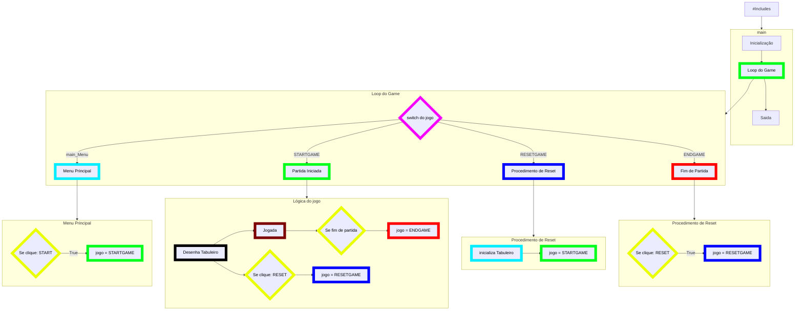

```mermaid
flowchart TD
    includes[#Includes] --> main
    subgraph main
        init[Inicialização] --> mainwhile[Loop do Game] --> return[Saida]
    end
        mainwhile --> mainwhile_code
        
        


    subgraph mainwhile_code[Loop do Game]

        main_switch{switch do jogo}
        main_switch -->|main_Menu| menu_principa[Menu Principal]
        main_switch -->|STARTGAME| STARTGAME[Partida Iniciada]
        main_switch -->|RESETGAME| RESETGAME[Procedimento de Reset]
        main_switch -->|ENDGAME| ENDGAME[Fim de Partida]
    end

    
    menu_principa --> menu_principa_code
    subgraph menu_principa_code[Menu Principal]
    if_startButton{Se clique: START}
    if_startButton --> |True| play_Game[jogo = STARTGAME]
    end      

    STARTGAME --> STARTGAME_code
    subgraph STARTGAME_code[Lógica do jogo]
    Desenha_STARTGAME[Desenha Tabuleiro]
    --> Jogada_STARTGAME[Jogada]
    --> if_ENDGAME{Se fim de partida} -->fim[jogo = ENDGAME]
    Desenha_STARTGAME[Desenha Tabuleiro]
    -->if_RESETBUTTON{Se clique: RESET}
    --> reset[jogo = RESETGAME]
    end    
    
    RESETGAME --> RESTARTGAME_code
    subgraph RESTARTGAME_code[Procedimento de Reset]
    reset_tabuleiro_RESTARTGAME[inicializa Tabuleiro] --> STARTGAME_RESTARTGAME[jogo = STARTGAME]
    end

    ENDGAME --> ENDGAME_code
    subgraph ENDGAME_code[Procedimento de Reset]
    if_resetButton{Se clique: RESET}
    if_resetButton --> |True| STARTGAME_ENDGAME[jogo = RESETGAME]
        
    end


    

  %% Separação Por Niveis:
  

  RESETGAME:::N5
  STARTGAME_ENDGAME:::N5
  reset:::N5
  main_switch:::N6
  mainwhile:::N8
  if_startButton:::N2
  if_resetButton:::N2
  if_RESETBUTTON:::N2
  if_ENDGAME:::N2                  
  Jogada_STARTGAME:::N7                  
  Desenha_STARTGAME:::N9                  
  fim:::N1                  
  ENDGAME:::N1                  
  play_Game:::N8 
  STARTGAME_RESTARTGAME:::N8                 
  STARTGAME:::N8                 
  menu_principa:::N4                 
  reset_tabuleiro_RESTARTGAME:::N4                 


  classDef done fill:#A5D6A7,color:#000;       %% Verde pastel, texto preto
  classDef available fill:#90CAF9,color:#000;  %% Azul pastel, texto preto
  classDef active fill:#EF9A9A,color:#000;     %% Vermelho pastel, texto preto


  %% Classes de cores dos níveis
  classDef N1 stroke:#FF0000,stroke-width:10px,color:#000;
  classDef N2 stroke:#EAFF00,stroke-width:10px,color:#000;
  classDef N3 stroke:#00074A,stroke-width:10px,color:#000;
  classDef N4 stroke:#00EEFF,stroke-width:10px,color:#000;
  classDef N5 stroke:#0004FF,stroke-width:10px,color:#000;
  classDef N6 stroke:#F700FF,stroke-width:10px,color:#000;
  classDef N7 stroke:#7D0000,stroke-width:10px,color:#000;
  classDef N8 stroke:#00FF1A,stroke-width:10px,color:#000;
  classDef N9 stroke:#000000,stroke-width:10px,color:#000;
```